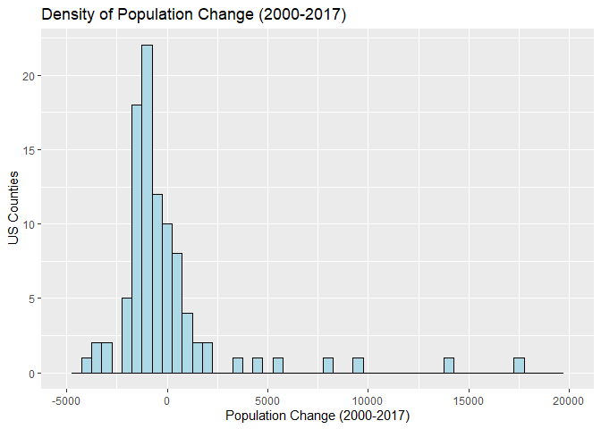
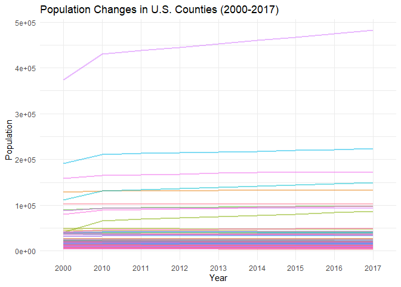
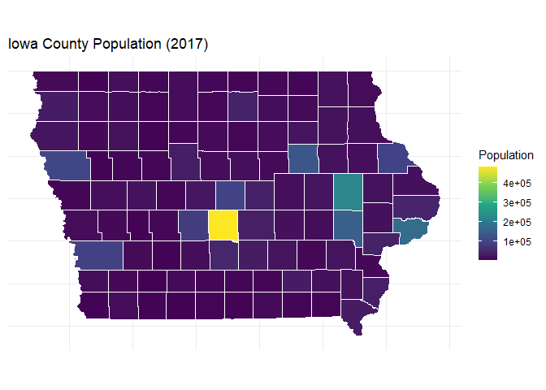
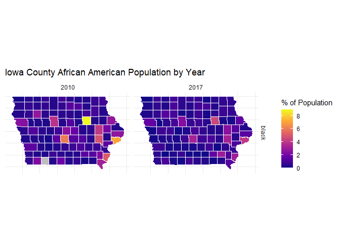
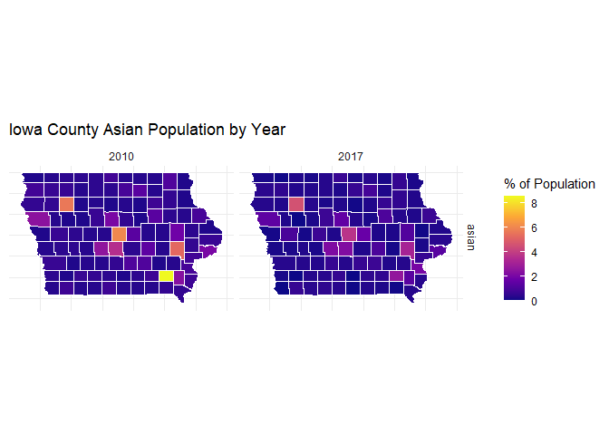
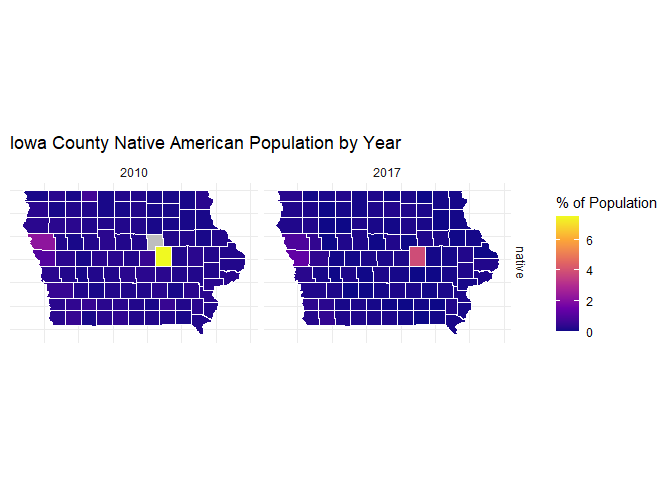
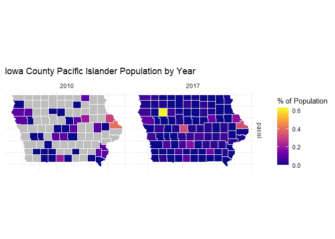
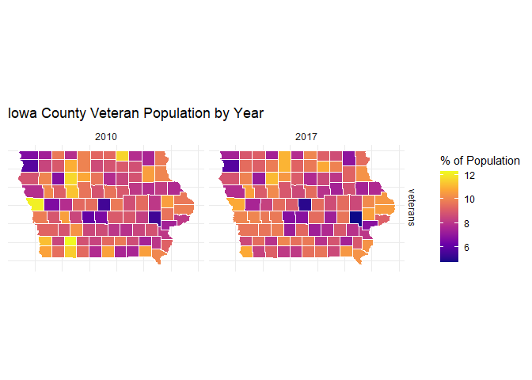

DS 202 Rollinger Final Project
================

# Analysis of Iowa Counties

Authors: Ethan Rollinger

## Abstract

This final project is examining the data set “county_complete”, which is
a data set that that holds information about each county in the entire
country of the United States. The data is from the U.S. Census Bureau’s
American Community Survey, which provides a large portion of
county-level characteristics. The main focus of this final project will
be looking at the population growth among the counties from the
information provided (2000 to 2017), along with looking at the racial,
ethnic and veteran composition for each county in Iowa. This in turn
will provide information and knowledge of the key demographic and social
factors and their variance geographically within the state. The
motivation for completing this project is to understand and explore the
general demographic of each county in Iowa and see what ideas and
insights can come from this for potential future studies and analyses.
The main findings for this project are:

- 1.  Counties with the highest population growth between 2000 and 2017
      were primarily located Central and Eastern, usually around larger
      urban areas and cities
- 2.  The average racial and ethnic demographic had a very large range
      of variability, with the more diverse populations being located in
      large metropolitan areas such as Des Moines and Iowa City
- 3.  Counties that had the highest percentage of veterans were more
      rural, and also consisted of slower population growth and on
      average older communities.

# Introduction

This topic of this project is the exploration of three key aspects of
county-level demographics in Iowa: population growth between 2000 and
2017, the average racial and ethnic composition of each county, and the
percentage of county residents who are military veterans. These factors
are important for understanding how local communities are changing over
time and how population shifts, diversity, and veteran representation
vary by region. Although these topics are often studied at the national
level, a smaller county-based analysis can show patterns and potential
correlations that may be unseen or overlooked.

This analysis is relevant because demographic trends such as population
growth, ethnicity rates and veteran composition can influence
decision-making on the government level. Some of these decisions can be
in areas such as healthcare access, infrastructure planning, education
funding, and social services. Understanding where populations are
growing, which areas are becoming more diverse, and where veteran
communities are concentrated can help influence policy making and
action.

This work is based on the county_complete data set, which compiles data
from the U.S. Census Bureau and the American Community Survey. The data
set includes multiple years of observations across all U.S. counties,
allowing a variety of comparisons to be made. For this project, a subset
of this data will be analyzed by looking at only Iowa. This is done for
better visuals of graphs.

In Section 1 (Results 1), population growth trends from 2013 to 2017
will be shown and which counties and regions experienced the most
change. Section 2 (Results 2) examines the racial and ethnic makeup of
counties to inform patterns of diversity. Finally, Section 3 (Results 3)
analyzes veteran status across counties with a larger focus on
differences between urban and rural areas.

# Data Summary

``` r
library(ggplot2)
library(dplyr)
library(tidycensus)
library(tidyverse)
library(tigris)
library(sf)

options(tigris_use_cache = TRUE)
```

The above code contains all of the packages that I will be using for
this project.

``` r
county_complete <- read.csv("https://www.openintro.org/data/csv/county_complete.csv")
View(county_complete)
```

The data set, as mentioned before comes from the U.S. Census Bureau and
the American Community Survey and can be found from the following link:
<https://www.openintro.org/data/index.php?data=county_complete>. As this
data set has been commonly used, minimal cleaning needs to be done to
this data set. It is compiled of data for all 3142 counties in the
United States. It contains 188 variables, where it has information
discussing population, percentage of ethnicities, education background,
household income and much more. For this project, I will be focusing on
the population, ethnicity demographic and veteran composition, so the
following variables will be important:

- state (State)
- name (County Name)
- fips (FIPS Code)
- pop2000 (Population in 2000)
- pop2010 (Population in 2010)
- pop2011 (Population in 2011)
- pop2012 (Population in 2012)
- pop2013 (Population in 2013)
- pop2014 (Population in 2014)
- pop2015 (Population in 2015)
- pop2016 (Population in 2016)
- pop2017 (Population in 2017)
- white_2010 (Percent of population that is white in 2010)
- black_2010 (Percent of population that is black in 2010)
- black_2017 (Percent of population that is black in 2017)
- native_2010 (Percent of population that is a Native American in 2010)
- native_2017 (Percent of population that is a Native American in 2017)
- asian_2010 (Percent of population that is a Asian in 2010)
- asian_2017 (Percent of population that is a Asian in 2017)
- pac_isl_2010 (Percent of population that is Hawaii or Pacific Islander
  in 2010)
- pac_isl_2017 (Percent of population that is Hawaii or Pacific Islander
  in 2017)
- hispanic_2010 (Percent of population that is Hispanic in 2010)
- hispanic_2017 (Percent of population that is Hispanic in 2017)
- veterans_2010 (Percent of population that are veterans from 2006-2010)
- veterans_2017 (Percent of population that are veterans in 2017)

``` r
county_selected <- county_complete %>%
  select(state,name,fips,pop2000,pop2010,pop2011,pop2012,pop2013,pop2014,pop2015,pop2016,pop2017,white_2010,black_2010,black_2017,native_2010,native_2017,asian_2010,asian_2017,pac_isl_2010,pac_isl_2017,other_single_race_2017,hispanic_2010,hispanic_2017,veterans_2010,veterans_2017)

View(county_selected)
```

The above code cleaned the data set and got rid of the unneeded
variables for this project. Using the above variable list, each variable
was selected to create the new data set “county_selected”. This was done
to simplify and condense the important data and to create a more
readable data set.

``` r
iowa_counties <-county_selected %>% filter(state == "Iowa")
```

The above code cleaned the data set even further to create a new data
set called “iowa_counties” in order to create a data set that only
focuses on data from Iowa counties. This will be the data set used for
the rest of the project.

# Results

## Results 1: Population Growth of Iowa Counties

This section analyzes the population changes across U.S. counties from
2000 to 2017. In depth population trends will be looked at, along with
different visuals that explore the comparisons between counties
throughout the given years.

``` r
iowa_counties <- iowa_counties %>%
  mutate(pop_change_2000_2017 = pop2017 - pop2000)

View (iowa_counties)
```

This line of code inserted a new column that shows the total population
change between the range limits of the years (2000 and 2017).

### Population Growth from 2000 to 2017

``` r
ggplot(iowa_counties, aes(x = pop_change_2000_2017)) +
  geom_histogram(fill = "lightblue", color = "black", binwidth = 500) +
  labs(
    title = "Density of Population Change (2000-2017)",
    x = "Population Change (2000-2017)",
    y = " US Counties"
  ) + scale_x_continuous(limits = c(-5000, 20000))
```

    ## Warning: Removed 4 rows containing non-finite outside the scale range
    ## (`stat_bin()`).

    ## Warning: Removed 2 rows containing missing values or values outside the scale range
    ## (`geom_bar()`).

<!-- -->

The plot consists of a histogram showing the distribution of population
change from 2000 to 2017. The graph shows that most counties experienced
zero or negative population growth, with the bell curve being centered
around the -2000 range. However, there are four outliers on the higher
end of the population change spectrum, indicating a few counties with
unusually high growth, creating some curiosity and potential followup as
to why there is such a large increase in population growth.

### Population Growth from Each Year

``` r
pop_data_long <- iowa_counties %>%
  gather(key = "year", value = "population", pop2000:pop2017)

ggplot(pop_data_long, aes(x = year, y = population, group = name, color = name)) +
  geom_line(alpha = 0.5, size = 1) +
  labs(title = "Population Changes in U.S. Counties (2000-2017)",
       x = "Year", y = "Population") + scale_x_discrete(labels = function(x) gsub("pop", "", x)) +
  theme_minimal() +
  theme(legend.position = "none")
```

<!-- -->

This plot shows population trends for each county from 2000 to 2017,
with each line representing a different county. The population generally
is flat over time, but some hold little growth in more urban
counties.The outliers can be found in more urban areas (Polk County) as
mentioned before, which suggests for more exploration into local
demographic factors.

### Comparing Population Across Counties from 2017

``` r
iowa_map <- tigris::counties(state = "IA", cb = TRUE, class = "sf")

pop_data <- iowa_counties %>%
  mutate(name = gsub(" County", "", name)) %>%
  select(name, pop2017) %>%
  rename(population = pop2017)

pop_data_long <- iowa_counties %>%
  mutate(name = gsub(" County", "", name)) %>%
  pivot_longer(cols = starts_with("pop"), 
               names_to = "year", 
               values_to = "population") %>%
  mutate(year = gsub("pop", "", year))


iowa_map$name <- gsub(" County", "", iowa_map$NAMELSAD)


iowa_merged <- iowa_map %>%
  left_join(pop_data, by = "name")

ggplot(iowa_merged) +
  geom_sf(aes(fill = population), color = "white") +
  scale_fill_viridis_c(option = "viridis") +
  labs(title = "Iowa County Population (2017)", fill = "Population") +
  theme_minimal() +
  theme(
    axis.text = element_blank(),  
    axis.ticks = element_blank(),  
    axis.title = element_blank()) 
```

<!-- -->

This plot visualizes the population in 2017 for each county. The
population from 2017 is generally higher in counties with large cities,
such as Polk, Linn and Johnston County. Some counties exhibit very low
population, mainly found in the rual parts of the State, which helps
explain why there population is so low.

Errors I ran into in this section were creating the Iowa map. Slowly
walking myself through the correct steps to make the map and have the
data correctly merged into it took some time. I spent a great deal of
time going back and forth from stackoverflow and chat gpt to correctly
have everything line up. I also had some struggles with the formatting
of the graphs. I wanted to make everything visually appealing, so slowly
tweaking the theme functions of each graph also took some time.

## Results 2: Racial and Ethnic Composition

This section analyzes the ethnic composition of Iowa counties, comparing
data from 2010 and 2017. The analysis will focus on the following racial
groups: African American, Hispanic, Asian, Native American and Pacific
Islander.

### Racial Composition: African Americans

``` r
ethnicity_pct_black <- iowa_counties %>%
  mutate(name = gsub(" County", "", name))

ethnicity_long_black <- ethnicity_pct_black %>%
  pivot_longer(
    cols = c(black_2010, black_2017),
    names_to = c("race", "year"),
    names_sep = "_",
    values_to = "percent"
  )

iowa_map_long_black <- iowa_map %>%
  left_join(ethnicity_long_black, by = "name")

ggplot(iowa_map_long_black) +
  geom_sf(aes(fill = percent), color = "white") +
  scale_fill_viridis_c(option = "plasma", na.value = "gray") +
  facet_grid(race ~ year) +
  labs(title = "Iowa County African American Population by Year", fill = "% of Population") +
  theme_minimal() +
  theme(
    axis.text = element_blank(),  
    axis.ticks = element_blank(),  
    axis.title = element_blank()  
  )
```

<!-- -->

This map illustrates the percentage of African American population in
Iowa counties, separated by year (2010 and 2017). The main finding
reveals that African American population percentages have stayed
relatively stable in most counties, with only slight increases in urban
counties between 2010 and 2017. Outliers are seen in counties with
larger urban populations, where the percentage of African residents is
more significant compared to rural areas, where the percentage is lower.

### Racial Compsoition: Hispanics

``` r
ethnicity_pct_hispanic <- iowa_counties %>%
  mutate(name = gsub(" County", "", name))

ethnicity_long_hispanic <- ethnicity_pct_hispanic %>%
  pivot_longer(
    cols = c(hispanic_2010, hispanic_2017),
    names_to = c("race", "year"),
    names_sep = "_",
    values_to = "percent"
  )

iowa_map_long_hispanic <- iowa_map %>%
  left_join(ethnicity_long_hispanic, by = "name")

ggplot(iowa_map_long_hispanic) +
  geom_sf(aes(fill = percent), color = "white") +
  scale_fill_viridis_c(option = "plasma", na.value = "gray") +
  facet_grid(race ~ year) +
  labs(title = "Iowa County Hispanic Population by Year", fill = "% of Population") +
  theme_minimal() +
  theme(
    axis.text = element_blank(),
    axis.ticks = element_blank(),  
    axis.title = element_blank()   
  )
```

<!-- -->

The map visualizes the percentage of Hispanic population in Iowa
counties, facet-wrapped by year (2010 and 2017).The main finding shows
some variation in Hispanic population percentages across counties, with
some counties experiencing an increase from 2010 to 2017. Outliers
include a few counties with exceptionally high percentages, such as
those near large urban centers, while many counties show very low
Hispanic populations.

### Racial Composition: Asians

``` r
ethnicity_pct_asian <- iowa_counties %>%
  mutate(name = gsub(" County", "", name))

ethnicity_long_asian <- ethnicity_pct_asian %>%
  pivot_longer(
    cols = c(asian_2010, asian_2017),
    names_to = c("race", "year"),
    names_sep = "_",
    values_to = "percent"
  )

iowa_map_long_asian <- iowa_map %>%
  left_join(ethnicity_long_asian, by = "name")

ggplot(iowa_map_long_asian) +
  geom_sf(aes(fill = percent), color = "white") +
  scale_fill_viridis_c(option = "plasma", na.value = "gray") +
  facet_grid(race ~ year) +
  labs(title = "Iowa County Asian Population by Year", fill = "% of Population") +
  theme_minimal() +
  theme(
    axis.text = element_blank(), 
    axis.ticks = element_blank(), 
    axis.title = element_blank()  
  )
```

<!-- -->

The map shows the percentage of Asian population in Iowa counties,
divided by year (2010 and 2017). The main finding indicates that some
counties have seen a noticeable increase in their Asian population from
2010 to 2017, particularly in more metropolitan areas. Outliers include
counties with substantial growth in Asian populations, likely due to
international migration or relocation, while many rural counties report
low percentages of Asian residents.

### Racial Compsoition: Native Americans

``` r
ethnicity_pct_na <- iowa_counties %>%
  mutate(name = gsub(" County", "", name))

ethnicity_long_na <- ethnicity_pct_na %>%
  pivot_longer(
    cols = c(native_2010, native_2017),
    names_to = c("race", "year"),
    names_sep = "_",
    values_to = "percent"
  )

iowa_map_long_na <- iowa_map %>%
  left_join(ethnicity_long_na, by = "name")

ggplot(iowa_map_long_na) +
  geom_sf(aes(fill = percent), color = "white") +
  scale_fill_viridis_c(option = "plasma", na.value = "gray") +
  facet_grid(race ~ year) +
  labs(title = "Iowa County Native American Population by Year", fill = "% of Population") +
  theme_minimal() +
  theme(
    axis.text = element_blank(),
    axis.ticks = element_blank(), 
    axis.title = element_blank() 
  )
```

<!-- -->

The map visualizes the percentage of Native American population in Iowa
counties, facet-wrapped by year (2010 and 2017). The main finding shows
that the Native American population is relatively small in most
counties, with only a few counties showing noticeable changes from 2010
to 2017. Outliers include Tama County, which has more significant Native
American populations due to there being a reservation in this county.

### Racial Composition: Pacific Islanders

``` r
colnames(iowa_counties) <- gsub("pac_isl", "pacisl", colnames(iowa_counties))

ethnicity_pct_pacisl <- iowa_counties %>%
  mutate(name = gsub(" County", "", name))

ethnicity_long_pacisl <- ethnicity_pct_pacisl %>%
  pivot_longer(
    cols = c(pacisl_2010, pacisl_2017),
    names_to = c("race", "year"),
    names_sep = "_",
    values_to = "percent"
  )

iowa_map_long_pacisl <- iowa_map %>%
  left_join(ethnicity_long_pacisl, by = "name")

ggplot(iowa_map_long_pacisl) +
  geom_sf(aes(fill = percent), color = "white") +
  scale_fill_viridis_c(option = "plasma", na.value = "gray") +
  facet_grid(race ~ year) +
  labs(title = "Iowa County Pacific Islander Population by Year", fill = "% of Population") +
  theme_minimal() +
  theme(
    axis.text = element_blank(),  
    axis.ticks = element_blank(),
    axis.title = element_blank()  
  )
```

<!-- -->

This map highlights the percentage of Pacific Islander population in
Iowa counties, facet-wrapped by year (2010 and 2017). The main finding
shows that the Pacific Islander population remains quite small across
most counties, with minimal changes between 2010 and 2017, along with
many missing data from 2010. Outliers include counties with small, yet
significant, Pacific Islander populations, particularly in areas with
local immigrant communities, while other counties have negligible
percentages.

I ran into a lot of errors with this section, mainly with the formatting
of the maps. I originally had all of the maps shown in one visual, but
the color scale was not very even, as it only produces different colors
for the hispanic populations as they are the majority of the minority
groups. To combat this problem, I switched to making them all their own
maps to better shown the population differences. I also had trouble with
creating new data sets and function and merging them all into the map.

## Results 3: Veteran Status

In this section, we examine the veteran status across counties for both
2010 (data from 2006-2010) and 2017. This is useful for understanding
how veteran populations are distributed and how this has changed over
time in Iowa.

### Veteran Percentage in 2010 and 2017

``` r
iowa_counties <- iowa_counties %>%
  rename(veteran_2010 = veterans_2010)

iowa_counties <- iowa_counties %>%
  mutate(veterans_2010 = 100 * veteran_2010 / pop2010)
```

There was an error in the dataset, as veterans_2010 listed the total
number of veterans living in each county, where veterans_2017 listed the
percentage of the population that are considered veterans. The above
code creates a new column (veteranspct_2010) which will be used instead
of veterans_2010 to create the following graph.

``` r
veteran_pct <- iowa_counties %>%
  mutate(
    veterans_2010 = 100 * veteran_2010 / pop2010,
    name = gsub(" County", "", name)
  )

veteran_long <- veteran_pct %>%
  pivot_longer(
    cols = c(veterans_2010, veterans_2017),
    names_to = c("group", "year"),
    names_sep = "_",
    values_to = "percent"
  )


iowa_map_long_veteran <- iowa_map %>%
  left_join(veteran_long, by = "name")

ggplot(iowa_map_long_veteran) +
  geom_sf(aes(fill = percent), color = "white") +
  scale_fill_viridis_c(option = "plasma", na.value = "gray") +
  facet_grid(group ~ year) +
  labs(title = "Iowa County Veteran Population by Year", fill = "% of Population") +
  theme_minimal() +
  theme(
    axis.text = element_blank(),
    axis.ticks = element_blank(),
    axis.title = element_blank()
  )
```

<!-- -->

The map displays the percentage of veterans in Iowa counties, using a
facet grid to compare 2010 and 2017 values. The main finding shows a
slight decline in veteran population percentages in many counties from
2010 to 2017, likely reflecting aging demographics. Some rural counties
exhibit notably higher veteran percentages, while others—especially
urban centers—show lower values, suggesting differing patterns of
settlement or veteran services availability.

This results section was relatively easy, as it followed a similar style
to the result \#2. One trouble I did have was the veteran_2010 and
vetern_2017 differences. One variable was in percentages while the other
was total population, so I had some initial trouble in the maps. Once I
figured this problem out, the rest went smoothly.

# Conclusions

This analysis explored population growth, ethnic composition, and
veteran status across Iowa counties from 2000 to 2017. The results
showed that while it is true that not all counties experienced the same
levels, some did see population growth over that time. Most, however,
saw little to no growth, and some even regressed. Ethnic composition
also shifted over time, with notable changes in the percentage of
African American, Hispanic, and Native American populations from 2010 to
2017, reflecting broader demographic trends in the country.
Additionally, veteran status data revealed a decline in the percentage
of veterans in many counties, suggesting changing dynamics in this
population group.Veterans were also more spread into rural areas rather
than urban areas. A limitation of this analysis is the lack of detailed
socio-economic variables that could further explain these patterns,
along with not as current of data. With more time or team members, it
would have been beneficial to explore the other variables in this data
set, such as education and household income, and see if this ties into
the demographics discussed.

## References

- <https://www.openintro.org/data/index.php?data=county_complete>
- <https://stackoverflow.com/questions>
- <https://chatgpt.com/>
